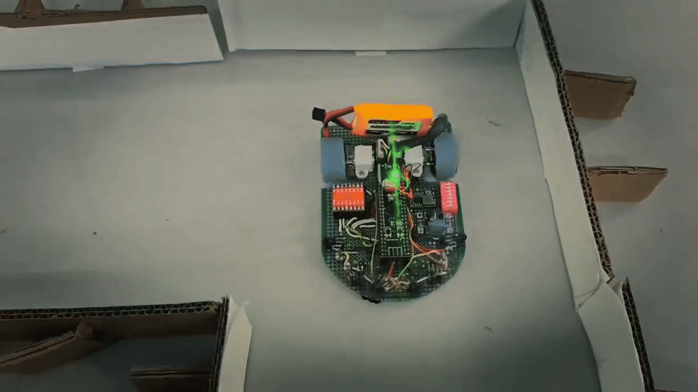
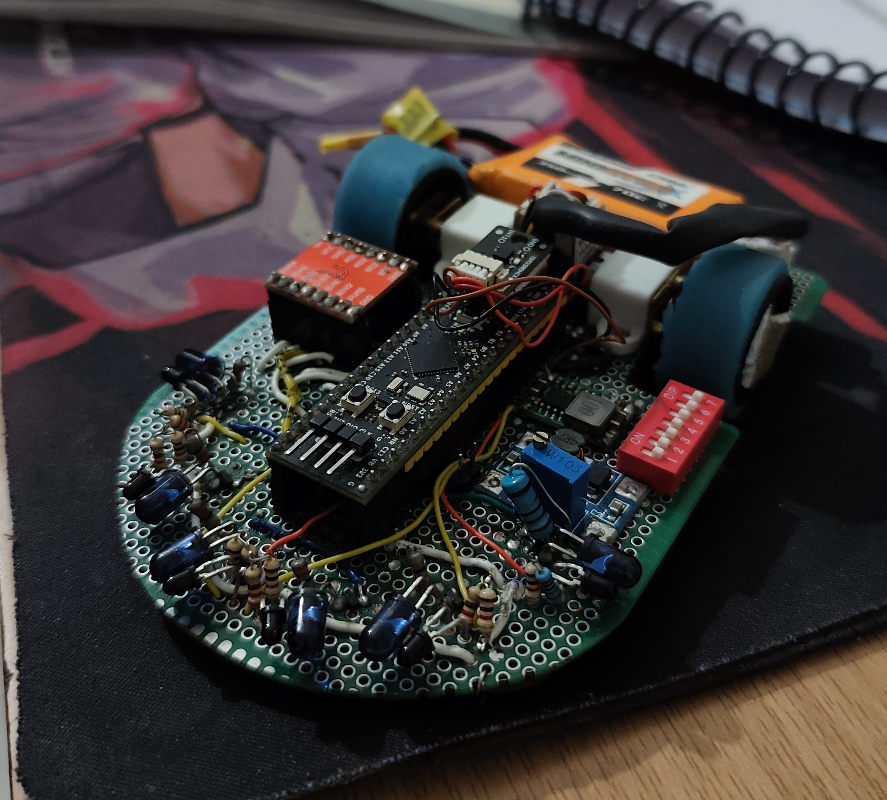
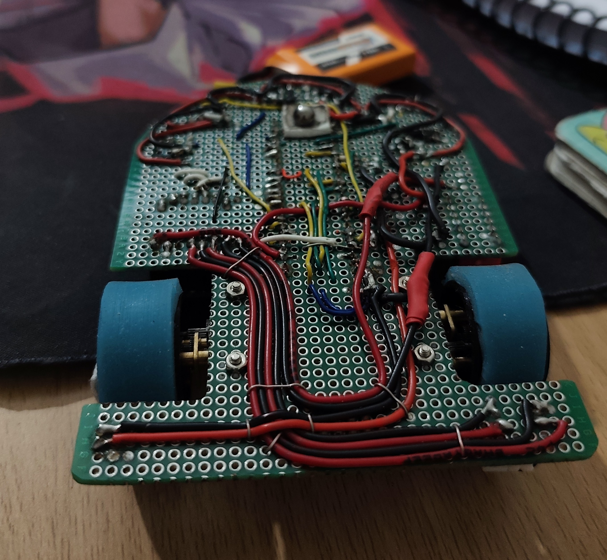

# Pascal — Micromouse v3

> Third-generation micromouse robot: a ground-up rework of
> [Heisenberg](https://github.com/Drakren/Heisenberg) — featuring custom IR wall
> sensors, an industrial-grade IMU, and a transition from AVR to the STM32G431 architecture —
> engineered for high-speed, reliable maze-solving.

[](https://youtu.be/90-_f9ux91c)


<p align="center">
  
</p>
<p align="center">
  
  
</p>

> **Team Project — Lead Architect & Project Owner.** Pascal was engineered at the SAE Club, UIET (Panjab University), where I served as the overall Project Lead. This repository (`SAE-Projects/Pascal`) is the official team repository, which I manage and maintain. This fork (`Drakren/Pascal`) mirrors the project under my personal profile. See [My Role](#my-role) for team dynamics, responsibilities, and individual technical contributions.

## Table of Contents
- [Overview](#overview)
- [My Role](#my-role)
- [Demo](#demo)
- [System Architecture](#system-architecture)
- [Hardware](#hardware)
- [How It Works](#how-it-works)
- [Results](#results)
- [Getting Started](#getting-started)
- [Repository Structure](#repository-structure)
- [Design Evolution: Heisenberg → Pascal](#design-evolution-heisenberg--pascal)
- [Acknowledgements](#acknowledgements)

## Overview
**Problem:** While Heisenberg (v2) successfully validated our core maze-solving algorithms, severe hardware constraints bottlenecked its speed and reliability:
- **AVR-based MCU:** The lack of a robust Nested Vectored Interrupt Controller (NVIC) and slower clock speeds restricted the execution frequency of the PD/heading correction loops.
- **Ultrasonic Ranging:** The wide acoustic cone of the ultrasonic modules caused false corner detections, compounding state estimation errors in larger mazes.
- **Encoder Drift:** Frequent missed encoder ticks (due to AVR interrupt latency) and physical wheel slip degraded odometry.
- **Low-cost IMU:** The integration of an MPU9255 clone introduced significant noise into heading corrections, further destabilizing high-speed runs.

**Approach:** Pascal represents a complete architectural overhaul designed to eliminate these sensory and computational limits:
- **Custom IR Sensor Circuitry:** Replaced off-the-shelf ultrasonics with custom, in-house designed infrared circuitry for narrow-beam, highly precise wall detection.
- **Industrial-Grade IMU:** Integrated the ISM330DHCX to replace the noisy clone sensor, dramatically improving heading stability.
- **STM32G431 MCU Integration:** Upgraded the compute stack to leverage the STM32's Floating-Point Unit (FPU), Data Watchpoint and Trace (DWT) unit, and high-resolution timers. This provided the crucial signal-processing headroom and real-time control precision that the previous AVR architecture could not support.

**Outcome:** Pascal won APOGEE '26, solving a 16x16 maze (20x20cm cells) in 55 seconds on its fastest run.

## My Role
- **Role:** Project Owner & Team Lead, SAE Micromouse Team.
- **Team Size:** 3 members.
- **Direct Technical Contributions:** Architected the complete C/C++ firmware stack for the STM32G431. Designed the custom IR sensor circuitry and integrated the ISM330DHCX for advanced sensor fusion. Re-tuned the Proportional-Derivative (PD) control loops to accommodate the lighter chassis and optimized the matrix-based flood-fill algorithm for maximum traversal speed.
- **Leadership Scope:** Directed the transition from AVR to STM32, established the project timeline for the APOGEE '26 competition, coordinated hardware/firmware integration across subteams, and maintained the central repository (including branch strategy, code reviews, and PR merges).

## Demo
🎥 [Watch Pascal's winning maze-solving run at APOGEE '26](https://youtu.be/90-_f9ux91c)

The GIF at the top of this README is Pascal live-navigating a maze — the green sensor glow visible on the protoboard is the custom IR array actively reading walls in real time.

## System Architecture
```text
[Custom IR sensors + IMU] → [Sensor Fusion / Heading Correction]
                              ↓
         [Encoders + IMU] → [Floodfill + BFS Algorithm]
                              ↓
                    [Path Decision Logic]
                              ↓
              [PD Speed Control] → [Motor Drivers]
```
**Stack:** STM32G431 (Cortex-M4, FPU + DWT), C/C++, STM32Cube HAL (generated via STM32CubeMX from `Fresh_Pascal.ioc`).

## Hardware
| Component | Part | Notes |
|---|---|---|
| MCU | STM32G431 | FPU + DWT + high-res timers for zero-latency control loop execution |
| IMU | ISM330DHCX | Industrial-grade; eliminates heading noise present in v2 |
| Wall Sensors | Custom IR Circuitry | In-house design providing significantly narrower detection cones than ultrasonics |
| Motors | N20 Geared DC (300 RPM) | Integrated quadrature encoders, 3 PPR on the shaft, for distance/speed feedback |
| Chassis | Zero board (protoboard), 10 x 12 cm, ~200g | Compact footprint and low mass, engineered for a reduced turning radius |

## How It Works
The maze-solving pipeline runs in two coupled stages:

- **Perception & state estimation:** The custom IR sensor array reads wall presence at each cell boundary, while the ISM330DHCX provides heading data fused into quadrature-encoder-based odometry — correcting for the drift that plagued Heisenberg's AVR + MPU9255 setup.
- **Path planning:** A flood-fill algorithm builds a cost matrix over the explored maze, combined with BFS to compute the shortest known path as exploration progresses.
- **Motion control:** A PD control loop, retuned for Pascal's lighter frame, regulates wheel speed against encoder feedback, converting planned paths into motor commands.

Core logic lives under [`Core/`](Core/) — *(once you point me to the specific source files for flood-fill, PD control, and sensor fusion inside `Core/Src`, I can link each bullet above directly to its file so a reviewer can jump straight to the code)*.

## Results
- **Competition:** Won APOGEE '26.
- **Maze:** 16x16 grid, 20x20cm cells.
- **Fastest run:** 55 seconds.
- **Runs:** 2.

## Getting Started
### Prerequisites
```
STM32CubeIDE / STM32CubeMX
```
### Build & Flash
```bash
git clone https://github.com/Drakren/Pascal.git
cd Pascal
```
Open the project via `Fresh_Pascal.ioc` in STM32CubeIDE, compile, and flash to the STM32G431 target.

## Repository Structure
```
.
├── .settings/
├── Core/                        # main application source (HAL config, control logic, sensor drivers)
├── Debug/                       # build output
├── Drivers/                     # STM32 HAL / CMSIS drivers
├── PascalMiscVideosAndPics/
│   ├── Top.jpeg
│   ├── Bottom.jpeg
│   ├── MicromouseDemoGif.gif
│   └── micromouseDemo.mp4
├── APOGEE.pdf                   # competition documentation
├── Team Mozzarella.pdf
├── Fresh_Pascal.ioc              # STM32CubeMX project config
├── STM32G431CBUX_FLASH.ld
└── README.md
```

## Design Evolution: Heisenberg → Pascal
Pascal wasn't a chassis tweak — it was a full rework of every system that limited Heisenberg's performance:

| Feature | Heisenberg (v2) | Pascal (v3) |
|---|---|---|
| **MCU** | AVR (8-bit, no NVIC) | STM32G431 (32-bit, FPU, DWT, high-res timers) |
| **Wall Sensing** | Ultrasonic (wide cone, false corners) | Custom in-house discrete IR circuitry |
| **IMU** | MPU9255 (clone, noisy) | ISM330DHCX (industrial-grade) |
| **Odometry** | High drift (wheel slip + AVR interrupt drops) | Highly stable (high-res timers + hardware interrupt handling) |
| **Chassis** | *(add v2 size/weight if you have it)* | 10 x 12 cm, ~200g |
| **Solve Time** | *(add v2 time if known)* | 55 seconds (16x16 maze) |
| **Key Change** | Prototyping focus | Full sensor & MCU rework prioritizing speed and stability |

## Acknowledgements
Built by the SAE Club Micromouse team (**Team Mozzarella**) at UIET, Panjab University, which I led. Built on the design foundation of the earlier iteration, [Heisenberg](https://github.com/Drakren/Heisenberg). Full competition documentation available in [`APOGEE.pdf`](APOGEE.pdf).

---
**Author:** Mohammed Talha · [LinkedIn](https://www.linkedin.com/in/talha-mohammed-13-04-eee)
